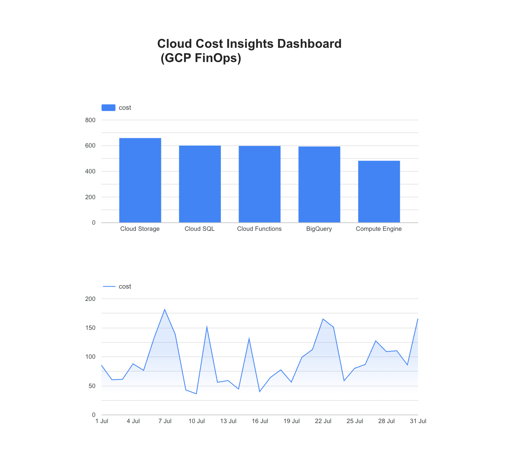

# 💸 Cloud Cost Insights Dashboard (GCP FinOps Project)

This project simulates a real-world FinOps use case — analyzing cloud costs using **Google Cloud Platform (BigQuery + Looker Studio)**. It processes GCP billing data, detects cost trends and anomalies, and visualizes spend by service, project, and time.


---

## 📊 Project Overview

- **Goal:** Build a cost analytics dashboard for cloud infrastructure using real tools (BigQuery + SQL + Looker Studio).
- **Data:** Mock GCP billing data simulating daily usage across services and projects.
- **Output:** An interactive dashboard that helps track cost by service, project, and date — with anomaly detection built in.

---

## 🛠 Tech Stack

| Tool              | Purpose                            |
|-------------------|-------------------------------------|
| **BigQuery**      | Data storage and SQL processing     |
| **Looker Studio** | Data visualization & dashboarding   |
| **SQL**           | Querying and transforming data      |
| **CSV**           | Mock billing data                   |
| **GitHub**        | Project sharing and documentation   |

---

## 🧱 Folder Structure
finops-cost-dashboard/
├── data/
│   └── mock_cloud_billing_data.csv
├── sql/
│   ├── total_cost_by_service.sql
│   ├── monthly_cost_trend.sql
│   └── anomaly_detection.sql
├── screenshots/
│   └── dashboard-overview.png
└── README.md

---

## 📂 Data Sample

Mock billing data includes:
- `usage_start_time` (timestamp)
- `service` (e.g., Compute Engine, BigQuery)
- `project_id` (dev, test, prod)
- `sku_description`
- `cost` (in USD)

---

## 📈 Dashboard Features

✅ Cost by service (bar chart)  
✅ Monthly spend trend (time series chart)  
✅ Cost anomaly detection (high-spend spikes)  
✅ Filters: by service, project, and date  
✅ Live data from BigQuery  
✅ Clean, minimalist dashboard title

---

## 🖼 Dashboard Preview



> *Built with Looker Studio, connected to BigQuery table from mock billing data.*

---

## 🧠 SQL Queries

### Total Cost by Service
```sql
SELECT 
  service, 
  ROUND(SUM(cost), 2) AS total_cost
FROM `your_project.cloud_billing_data.billing_table`
GROUP BY service
ORDER BY total_cost DESC;
```
### Monthly Cost Trend
```sql
SELECT 
  FORMAT_TIMESTAMP('%Y-%m', usage_start_time) AS month,
  ROUND(SUM(cost), 2) AS total_cost
FROM `your_project.cloud_billing_data.billing_table`
GROUP BY month
ORDER BY month;
```
### Anomaly Detection
```sql
SELECT 
  usage_start_time,
  service,
  cost
FROM `your_project.cloud_billing_data.billing_table`
WHERE cost > (
  SELECT AVG(cost) + 2 * STDDEV(cost)
  FROM `your_project.cloud_billing_data.billing_table`
)
ORDER BY cost DESC;
```

## 🚀 How to Run This Project

1.	Clone this repo
2.	Upload mock_cloud_billing_data.csv to BigQuery as billing_table
3.	Run SQL queries from the /sql folder
4.	Connect BigQuery to Looker Studio
5.	Build and share your dashboard

## 💡 Learning Highlights

•	Gained hands-on experience with BigQuery + Looker Studio
•	Learned FinOps basics: cost tracking, transparency, optimization
•	Practiced anomaly detection using SQL
•	Created a visual dashboard for technical + non-technical stakeholders
